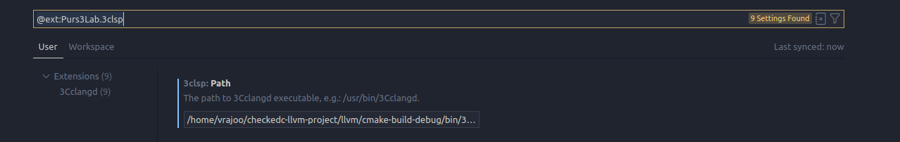

###  Caution
{: 	.text-red-300}
Before you install any extension on VSCode make sure that the original `clangd` extension if installed is uninstalled or disabled. Since our tool is build on top of `clangd` it can't function if both extensions are installed at the same time.
{: 	.text-red-300}

#  The VSCode Extension
- Open up VSCode
- Open Marketplace or press `Ctrl+Shift+X`
- Search for `3clsp`
- Install the extension and reload editor

- After installing the extension you have to set the `PATH` to your `3Cclangd`.
- Navigate to the build folder where you built the tool.
- `3Cclangd` would be in the `build/bin/3Cclangd`.
- Go to Vscode settings from `File > Preferences > Settings` or press `Ctrl+Comma`.
- Search for `3clsp`.
- Enter the path in the field given.

[Extension Page](https://marketplace.visualstudio.com/items?itemName=Purs3Lab.3clsp){: .btn .btn-purple }