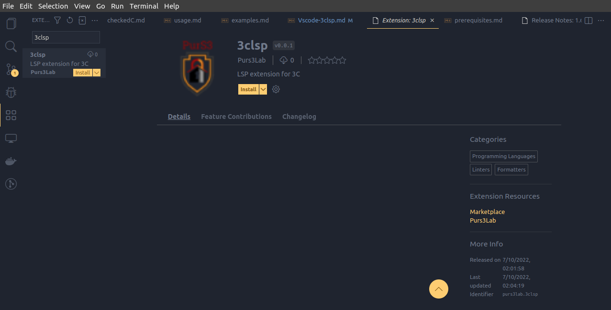

#  The VSCode Extension

- Open up VSCode
- Open Marketplace or press `Ctrl+Shift+X`
- Search for `3clsp`
- Install the extension and reload editor

[Extension Page](https://marketplace.visualstudio.com/items?itemName=Purs3Lab.3clsp){: .btn .btn-purple }