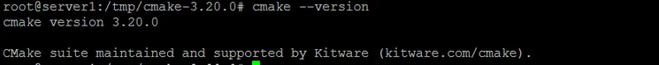

#### All the following tools and libraries were installed and tested to work on Ubuntu 18.04 and above.
{: .text-green-200}
# Pre-Requisites
{: .no_toc }

Before you start converting your code, you need to follow some simple steps to get your system ready for this tool.
{: .fs-6 .fw-300 }

#### [](#header-4) OS Supported

> Due to the restrictions by Microsoft the tool only works on Linux and Windows based operating systems.
> Basic installation of Linux and Windows OS makes sure that a C compiler and other basic build tools are pre-installed.

## [](#header-2) Basic Tools

Install essential tools with:
```sh
sudo apt-get install build-essential libssl-dev
```

### [](#header-3)VSCode
Visual Studio Code is a code editor developed by Microsoft and works best when using this tool, but any other code editor that supports **LSP** would work.

[VSCode](https://code.visualstudio.com/download){: .btn .btn-purple }

### [](#header-3)CMake

```sh
sudo apt-get -y install cmake
```
After the software is successfully installed, you can verify its installation and also if the correct version is installed, through the following command:
```sh
cmake --version
```



### [](#header-3)Ninja

This tool will build the compiler and all other supporting tools on your system.

[Ninja](https://github.com/ninja-build/ninja/releases){: .btn .btn-purple }

**Ninja** is also packaged by major packaged mangaers on UNIX OSes. For example on Ubuntu, you can :

```sh
sudo apt install ninja-build
```
### [](#header-3)Bear
3clsp needs a compilation databse to work. Bear uses your build command to automatically create CompDBs.

```sh
sudo apt install bear
```
[Bear Repo](https://github.com/rizsotto/Bear){: .btn .btn-purple }

Bear is [packaged](https://repology.org/project/bear/versions) for many distributions. Check out your package manager.

The output file called `compile_commands.json` is saved in the current directory.


### [](#header-3)Ccache(OPTIONAL)

Install ccache to speed up the compiler build on Linux.

```sh
sudo apt install ccache
```


### [](#header-3)LLD(OPTIONAL)

   LLD is a new, high-performance linker.

```sh
sudo apt update
sudo apt install lld
```
