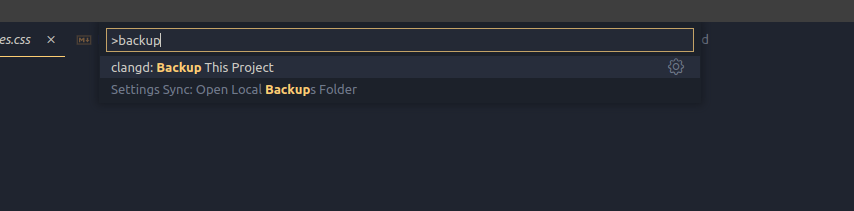
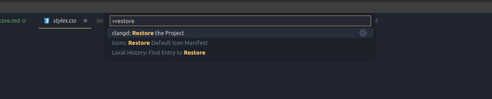

#  Not Happy with your Conversion

With the latest path updates to the extension. We added a new feature to **Backup** and **Restore** if the conversion was not perfect.

###  Caution
{: 	.text-red-300}
The feature uses `fs-extra` npm module for backing and restoring. So make sure that VSCode has the necessary permissions and always remember to backup first before you restore.
{: 	.text-red-300}

###  Backing Up
- Open up the command palette again (Press `Ctrl+Shift+P`).
- Search for `Backup your project`.
- Starts the Backup process.

###  Restoring The Project
- Open up the command palette again (Press `Ctrl+Shift+P`).
- Search for `Restore Your Project`.
- Starts the Restore process.

