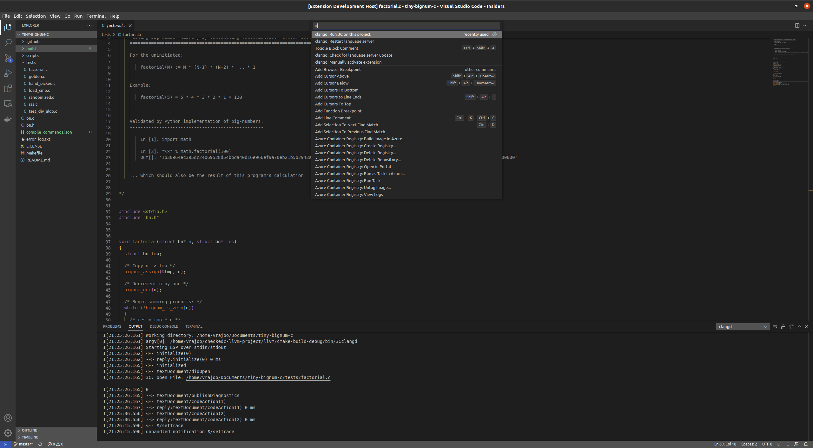
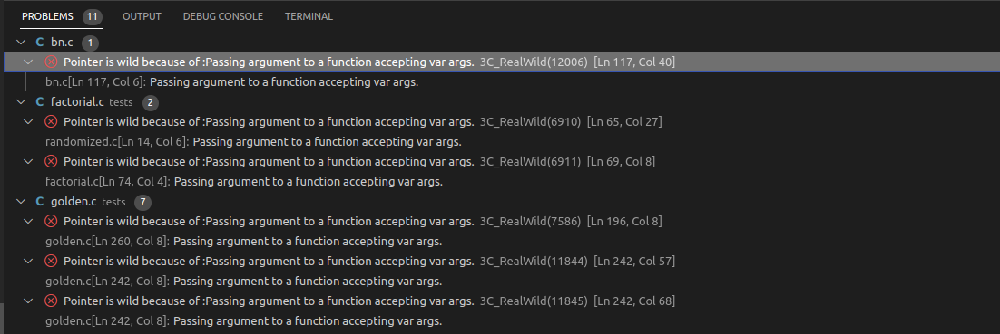
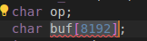
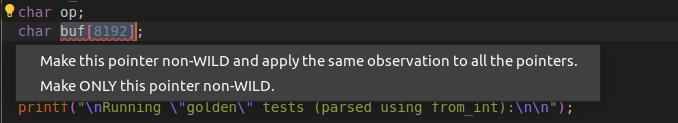

## [](#header-2) Before Conversion

Before you start conversion using the tool.
- Open up your terminal.
- ``Navigate`` to your project folder.
- Run ``` bear <- your build command->```

# [](#header-1)Using the Extension

- Open your project with `Ctrl+K & Ctrl+O`.
- Select your desired project from the window.
- Make sure your project has a compile database as mentioned earlier(`compile_commands.json`).
 

## [](#header-2) Starting the Conversion Process

- Navigate to any **C** file.
- Make sure the `3Cclangd` server starts up.
- Open the command palette by `Ctrl+Shift+P`.



<figcaption align = "center"><b>Command Palette in Action</b></figcaption>

- Search for `Run 3C on this project`.
- Run the command
 Depending on the size of the project, the conversion might take anywhere from 5-15 seconds to finish. The info boxes on the bottom right will serve as a guide to the progress of the conversion.

## [](#header-2) Root Causes and Diagnostics

- `3clsp` uses diagnostics as a means to report the root causes in your project.
- **Root Causes** refer to pointers or code segments that *3c* was unable to annotate due to various reasons like unsafe casts, variable arguments etc. 
- Each root cause in your project will be displayed in problems tab on the bottom left of the editor window.


<figcaption align = "center"><b>Diagnostics Window</b></figcaption>

## [](#header-2) Code Actions and Fixing Root Causes

- Simply head over to one of the diagnostics and look for the swiggly lines in your code.
- You might notice a light bulb next to it. These are actions for that specific diagnostic.




### [](#header-3)Making Pointers Non-Wild

- Once you press the light bulb, you are presented with two options. First `Make this pointer non-Wild and apply the observation everwhere`, this option makes sure that the pointer is made non-wild and make all the pointers that are wild due to the same reason non-Wild too. This option is generally safer if you have a good grip on what your project is coded like. But most times it's safer to convert these pointers one by one. This can be done by choosing the second option `Make ONLY this pointer non-WILD`.

- After selecting any one of these options, the tool will again rewrite your file but this time the aforementioned pointer would be safe or Checked. You might need to go through every one of the diagnostics and choose for yourself wheter the pointer you are about to declare is safe is indeed spatially safe. Most of the times our tool will mark a pointer as WILD because it it unsure how how the pointer is used in the project.

## [](#header-2) After Successful Conversion
{: .text-green-200}
- After the conversion process is complete, you need to compile your new checked `C` code. If you followed the [PATH instructions](https://purs3lab.github.io/3clsp/docs/installation/checkedC.html#path-instructions) you should have the compiler on your terminal.
- Compile your code using:
```sh
clang file-name.c
```

### [](#header-3) Not Happy with your conversion
{: .text-red-200}
- [Backup and Restore your Project](https://purs3lab.github.io/3clsp/docs/usage/backup_restore.html#-not-happy-with-your-conversion)